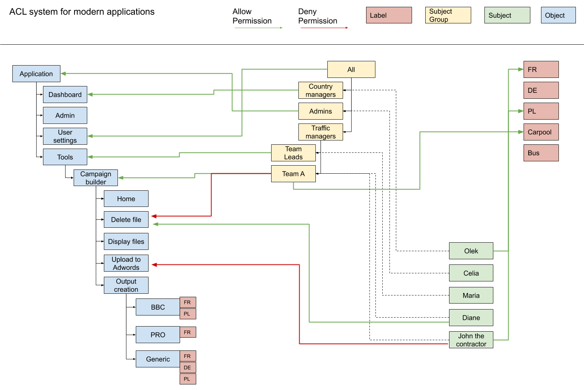

# Permission (ACL) system for complex applications

The objective of this project is to describe a pattern to declare fine grain permission within complex internal applications.

This pattern has been created with two objectives in mind:

* Be able to give access to the finest possible grain while being totally agnostic of the purpose of the software itself (works in every case)
* Keep the permissions simple by reducing the number of rules to declare

This answer to a need for a better control over what a user can or can’t do inside an application. For example, we may want to allow a user to see FR and ES campaigns but only to be allowed to delete the French campaigns.

Examples of usage can be any software that need to restrict certain actions (for certain users) to avoid any mistake or simply to deny access to sensitive information.

## Concepts
1. **Object**: An object can be anything in your app. It can be a webpage, a button, a chart, an action… An Object can have at max one parent and as many children as you want (including none).

2. **Subject**: Is an entity interacting with your application. Usually it’s a person, but it can be another application, a bot, or a specific part of your code. A subject can be attached to one or multiple Subject Groups.

3. **Subject** Group: Is a representation of multiple Subjects. It can have at max one parent and as many children as you want (including none).

4. **Label**: Serves to tag multiple objects with the same label. For instance, your application can deal with countries. In this case there is a big chance, you’ll have multiple objects that will deal with those countries (for examples: GMV chart and booking chart). To avoid recreating sub objects per country each time (for GMV chart and booking chart), label can be used. This concept will appear more explicit in the schema below. 

5. **Permission**: a permission is a link between a Subject or a Subject Group and an Object or a Label. Permissions exist in two ways: `allow` or `deny`.


## Inheritance

### For Objects
Objects are linked together as a tree. The permission attached to them are inherited from top to bottom.

Imagine the root (at the top) object is mapped with an `allow` permission to a subject A. This means that our subject A would have `allow` permissions on all child objects.

Now, let say we map a deny permission to a child object (call it Object B) of our root object. This would mean that our subject A would have `allow` permission to everything on top of our Object B, and a `deny` permission to all children of Object B (including the Object B itself).

See permission evaluation for me information.

### For Subject Groups
As for objects, Subject groups inherit permissions. A subject group would automatically have all his parents subject group’s permissions plus his own permissions.


## Permission Evaluation

To know if an object is allowed to access. The software only needs to know the current Subject (the user) and the Object in question. This makes the integration for developers very simple.

For example: “can Machavia access the app settings page” would look like this:
```go
acl.Eval("settings", "machavia") //return true or false
```

**Here how the evaluation works:**

First, we check if the Subject have permission attached to the targeted Object, if so we have an answer and we stop the evaluation.

If we don’t, we check if the Subject have permission attached to a parent of the targeted Object, if no we check the parent of the parent and so on…

we evaluate this from bottom to top (parent to parent to parent…). First Object in the tree to have a permission attached stops the evaluation.

This what we call this Object traversing.

If we didn’t find any permission attached in the previous step, we move to Subject’s groups permissions. For each Subject Group attached to our Subject, we run the Object traversing again, we the same rules.

Then, once all groups evaluated, it’s pretty straightforward:

Contrary permissions (or simply one `deny`) means `deny` - this can occur in case of Subjects attached to multiple Subject Groups that have contrary permissions to the same Object.

No permission at all means `deny`

## Real-life example
Below please find this pattern applied to a fictive marketing platform.



### All users
Have access to their setting page because they are part of `All` (or a child of it) which have an `allow` permission on `User settings`.

### Celia
Has access to everything because she is part of `Admin` which have an `allow` permission on `Application`.

Since `Application` is at the top level of the Object tree, all children inherit the `allow` permission.

### Maria
Has access to all the tools (and all their features) because she is part of `Team Leads` which have an `allow` permission on `Tools`.

Has also access to her settings because she is part of `Team Leads` which inherit of `All` which have an `allow` permission on `User settings`.
### Diane
Has access to the campaign builder because she is part of `Team A` which have an `allow` permission on `Campaign builder`.

She can also delete files because she (herself) has an `allow` permission on `Delete files` (which overwrite `Team A` `deny` permission on `Delete files`).

Has also access to her settings because she is part of `Team A` which inherit of `All` which have an `allow` permission on `User settings`.

### John the contractor
Has access to the campaign builder because he is part of `Team A` which have an `allow` permission on `Campaign builder`.

He can’t upload to Adwords though because he (himself) has a `deny` permission on `Upload to Adwords` (which overwrite `Team A` **inherited** `allow` permission on `Upload to Adwords`).

Has also access to his settings because he is part of `Team A` which inherit of `All` which have an `allow` permission on `User settings`.